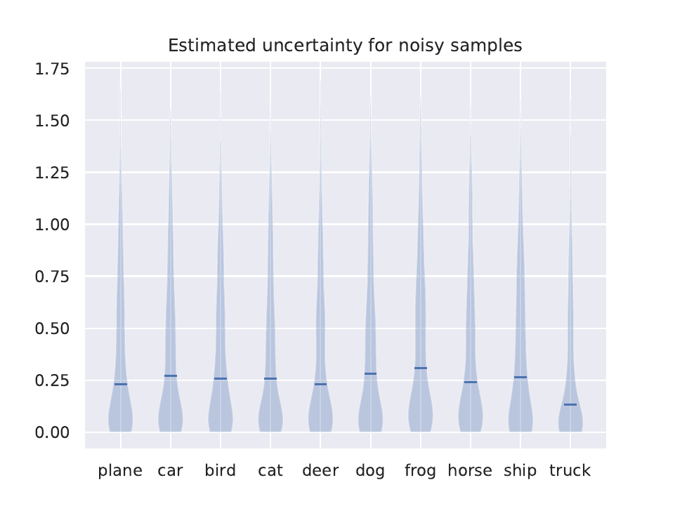

# Exploring uncertainty estimation for label noise
Using Monte Carlo dropout and the latent variable model of [1] we can learn uncertainty estimates that differentiate noisy samples from clean ones.

 

The predicted uncertainty and loss values for the trained model can be utilized to detect noisy samples. We can use the model predictions to correct low uncertainty - high loss points.

 

Experiments were performed on the CIFAR-10 dataset where the noisy to clean sample ratio was reduced from 0.21 -> 0.13.

References: 
- [1] M. Collier, B. Mustafa, E. Kokiopoulou, and J. Berent. Analysis of softmax approxi-
mation for deep classifiers under input-dependent label noise. 2020

- [2] A. Kendall and Y. Gal. What uncertainties do we need in bayesian deep learning for
computer vision? 2017
